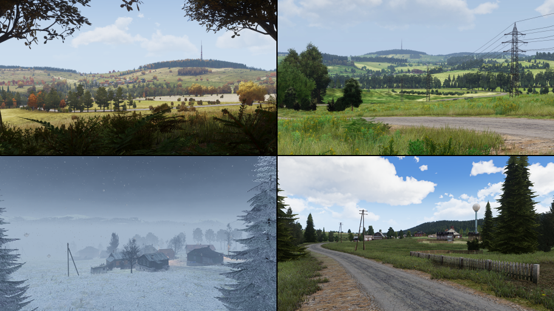

<head>
	<link href="twentytwenty/css/foundation.css" rel="stylesheet" type="text/css" />
	<link href="twentytwenty/css/twentytwenty.css" rel="stylesheet" type="text/css" />
	
	
	
	
</head>

Jason Deacutis 
jasondeacutis@gmail.com

## [Gunner, HEAT, PC! (GHPC)](https://gunnerheatpc.com/ "https://gunnerheatpc.com/")
*Tank combat simulation game, a cross between accessible arcade & military simulation. Translates to the crew command  "Gunner, use High Explosive Anti Tank ammunition on enemy Personnel Carrier!" (yes, its nerdy)*
### Vehicle Driver AI
Integrated AI into our physics vehicle controller, allowing vehicles to autonomously navigate to a destination while avoiding obstacles.



### Reticle System
Procedural crosshairs integrated with the ballistics system, allowing projectile trajectories to change on-the-fly for faster design iteration.
All in-game reticles are based on firsthand sources (often difficult to find).

[Stadiametric rangefinding](https://en.wikipedia.org/wiki/Stadiametric_rangefinding "wikipedia") allows quickly determining the distance of a target based on its apparent size. 
*[T-72](https://en.wikipedia.org/wiki/T-72 "wikipedia") stadia showing a [M60A3](https://en.wikipedia.org/wiki/M60_tank#M60A3_series "wikipedia") at 500 meter distance increments* 

### Thermal Imaging (FLIR)




### Day-Night Cycle
Realtime sky simulation, based on a simplified solar system model. Includes seasonal sun elevation, moon phases, & [earthshine](https://en.wikipedia.org/wiki/Planetshine#/media/File:New_Moon.jpg "real life earthshine (wikipedia)"). The moon is also simulated as a light source & brightness is affected by phase.



# ArmA 3 - [Community Upgrade Project](https://steamcommunity.com/workshop/filedetails/?id=583575232 "Steam Workshop")
*Crowd-sourced mod to port content to Arma 3 from preceding games (military sandbox).*
## [Terrains](https://www.cup-arma3.org/terrains "www.cup-arma3.org/terrains")


## Vehicles

# Personal Projects
## Minecraft Clone
*1-Month sprint to attempt to recreate [Minecraft](https://en.wikipedia.org/wiki/Minecraft "wikipedia") for fun. Implemented dynamic voxels and infinite terrain.* 

## [WebGL Demo](WebGL\index.html)
